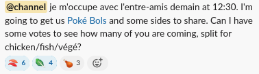

# `🍱` Social Lunch

Most weeks we have a [social lunch](https://www.google.com/calendar/event?eid=MDkyOWJ0bDRjNmU3ZmdwMWwzc3ZjZTRhdDJfMjAyMjA1MjZUMTYzMDAwWiBoNHRmaXJydHVydHQ4M29hbWhodDM5NnV2OEBn) at 12:30 Thursday,
sometimes overlap with our lab meetings.

They live on the strength of someone taking the lead to organize them each week. If that's you, here's a guideline to follow!

## Choose a restaurant

Find a restaurant that does delivery in the neighbourhood. You can look on [Google Maps](https://www.google.com/maps/search/Restaurants/@45.4933376,-73.6229251,14z/data=!3m1!4b1) to help you decide, or get creative and pick one from a word-of-mouth recommendation.

We budget 10$/person, so make sure the place is in that price range.

## Announce

24 hours before, go onto [#general](https://app.slack.com/client/T034UD4QN/C034UD4QW) and announce where you will order from.
Usually we pick two or three dishes from the menu, including at least one meat and at least one vegetarian option.
Add emojis to your announcement to let people vote on what they would like.

For example:

## Ordering

The next morning, or perhaps the night before depending on the restaurant,
put in an order to arrive half an hour early -- at about 12:00.
Ask them to deliver to Polytechnique's upper Lassonde / Pavillion Principal entrance, at 2500 Chemin de Polytechnique, Montréal.
Order as many meals as you have emojis, plus one as a spare.

When it arrives, pay with your personal funds. Make sure to get and save a receipt.

## Utensils

We have some metal utensils and paper plates in the cupboard in L5626.

If that's not enough, there is a staff lounge in the Pavillon Prinicpal that has plates and a washing machine.

## Washing Up

Use the sink or washing machine in the staff lounge.

## Nominations

At the end of lunch, you get to nominate next week's maître d'.

To make it easier and a bit more fun, you can try using Chwazi
[[iOS](https://apps.apple.com/us/app/chwazi-finger-chooser/id689674978)]
[[Android](https://play.google.com/store/apps/details?id=com.tendadigital.chwaziApp&gl=US)].

## Reimbursements

Again, save your receipts! If the restaurant sent you a confirmation email or gave you an order confirmation webpage, save that too.
When you get the final paper receipt, immediately take a photo of it, and save everything in a safe digital place like your email or a cloud account, and save the paper copies just in case.

Submit copies the receipt and any other documentation to dge.sec-biomedical@polymtl.ca. Your email should explain what the reimbursement is for, which PI is covering the costs and which account will be used. Contact your PI to ask about the latter and CC them in any correspondance.

It will take them about a month to process your request; they will fill out a [Demande de Paiement](https://share.polymtl.ca/alfresco/guestDownload/attach?path=/Company%20Home/Sites/si-formulaires/documentLibrary/Finances/Demande%20de%20paiement-Safirh.xlsm) for you and return it to you for signing.

After signing, it will be countersigned by your PI.

If you are salaried, the payment will be added to your next paycheque.
If you are consultant, it should be added to your next invoice.
If you are an intern [ TODO ].
